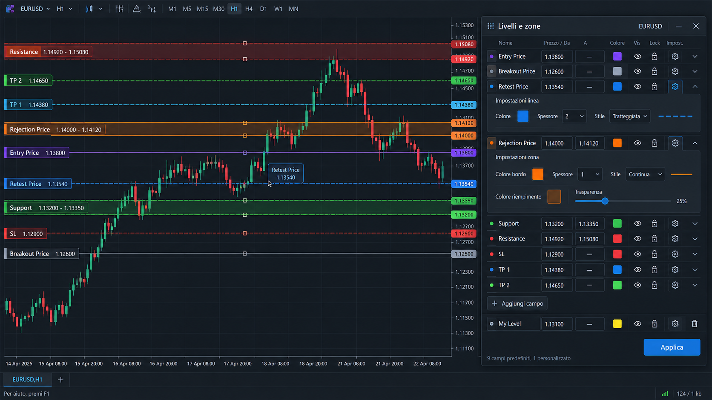

# MT5 Levels and Zones

A chart panel for drawing horizontal lines and price zones in MetaTrader 5. Enter a price, give it a name, and choose how it looks. Built for manual chart marking, with an English interface.

It draws only. It does not place orders, read positions, or generate trading signals.



*This image is the original design reference. The working panel uses native MT5 controls and starts with empty price fields.*

## What it does

- Includes Entry Price, Breakout Price, Retest Price, Rejection Price, Support, Resistance, SL, TP 1, and TP 2.
- Lets you rename fields and add your own.
- Draws a horizontal line for one price, or a filled zone for two prices.
- Offers line and fill colors, HEX input, solid or dashed lines, thickness, and transparency.
- Extends zones across the chart, including older candles.
- Shows names and prices on the left. Nearby labels are grouped, with details available on hover.
- Supports dragging lines, zone edges, or the whole zone. A lock prevents accidental moves.
- Saves when you click Apply or finish a drag.
- Keeps levels when you change timeframe. Charts with the same exact symbol share saved levels when the indicator is attached to each chart in the same terminal. Different symbols stay separate.

## Install

Download the ZIP from [Releases](https://github.com/MaurizioPremici/mt5-levels-zones/releases), then copy its `MQL5/Indicators/LevelsZones` folder into your MT5 data folder. You can find that folder from **File → Open Data Folder** in MT5.

Refresh the Navigator, then add **Indicators → LevelsZones → LevelsZones** to your chart. Add it to each chart you want to use.

To build from source, copy the files in `src` into `MQL5/Indicators/LevelsZones`, open `LevelsZones.mq5` in MetaEditor, and press **F7**. The indicator uses the standard libraries included with MT5.

For the standard MT5 Wine installation on macOS:

```sh
python3 build/compile.py
python3 build/install.py
```

You can pass a different MT5 data folder with `python3 build/install.py --data-dir PATH`.

## Use

Enter a price in **Price / From**. Leave **To** empty for a line, or enter the other end of the range for a zone. Click **Apply** to draw and save. Changes in the panel remain a draft until you apply them.

Under Wine, double-click a price field to edit it. Check the full value after pasting. Use a decimal point or comma, without thousands separators. Invalid text and prices with too many decimal places are rejected.

- **...** opens appearance settings.
- **ON/OFF** immediately shows or hides that saved level without pressing Apply. After All OFF, switch ON just the row you want to see; the others stay OFF. Prices are kept. New custom rows and price edits still need Apply before they can be drawn.
- **All OFF / All ON** immediately hides or shows every level and zone for the current symbol, including custom fields. Prices and styles are kept. Visibility is saved and synced to the other charts of that symbol; unfinished price edits stay in the draft.
- **L/U** locks or unlocks movement. Apply the change before dragging.
- **+ Add field** adds a custom field.
- **Up/Down** scrolls through the rows.
- **Clear all** immediately clears every price, line and zone for the current symbol, including locked and custom fields. Names and styles are kept. The empty values are saved and synced to the other charts of that exact symbol. Other pairs and drawings from other tools are unchanged.
- **Reload** discards the draft and loads the last saved values.
- **Double-click the title bar** to collapse or expand the panel. Drag the bar to move it.
- **x** hides the panel while keeping the drawings visible.

For a zone, drag either edge to resize it or the middle handle to move the whole range. Press Escape to cancel a drag. Apply or discard any draft before moving a drawing.

Transparency runs from 0% (opaque) to 100% (invisible). The default is 80%. `PanelScale` adjusts the panel size; display DPI is handled separately for Retina screens.

## Saved data

Levels are stored locally in `MQL5/Files/LevelsZones`. A `.bak` file keeps the previous saved version. If two charts edit the same symbol, an older draft cannot overwrite a newer save without reloading first.

Removing the indicator removes its drawings from that chart. Saved levels remain available when you add it again. The indicator supports up to 128 fields per symbol. It does not manage labels or objects created by other indicators.

## Templates

Templates that include Levels and Zones can be applied again without losing the panel. Version 1.0.3 also supports templates saved by older versions, which may contain stale internal objects. Saved prices are loaded from the current symbol's local store.

A template that does not include the indicator still removes it, as expected in MT5. Add Levels and Zones before saving the template you want to use as Default.

## Changes in 1.0.7

Chart updates no longer recreate the price fields. If the chart is resized while you are editing, the panel waits until you finish before updating its layout.

## Changes in 1.0.6

Each row's ON/OFF button now updates the chart immediately. Use All OFF, then turn ON just the level you need. Other rows stay hidden and all saved prices are kept. Clear all is unchanged.

## Changes in 1.0.5

Added All OFF / All ON to switch every level's visibility with one click. If some rows are ON and others OFF, the first click turns them all OFF; the next turns them all ON.

## Changes in 1.0.4

Double-click the title bar to collapse or expand the panel. Dragging still moves it, and the panel remembers whether it was collapsed.

## Changes in 1.0.3

Fixed the panel disappearing after loading a template containing Levels and Zones. Old templates could restore an internal marker that was mistaken for an active instance. The instance check now uses a temporary runtime lock, and restored panel objects are rebuilt from saved symbol data.

## Changes in 1.0.2

Added Clear all. Button events are now restricted to this panel, so clicking another tool no longer resets its buttons.

## Changes in 1.0.1

The interface is now in English, including tooltips and validation messages. Panel dragging uses cached control positions instead of repeatedly reading them from the chart. Updates are capped at about 30 per second, with the final position applied on release. Saved levels remain compatible with version 1.0.0.

## Current status

Compiled with **0 errors and 0 warnings**. Basic line drawing, zone drawing, and saved values across H4/H1 changes were checked in MT5 on macOS through Wine. Panel and label sizing were adjusted for Retina displays.

This is a preview release. Full manual testing is still in progress, including clipboard editing under Wine, dragging, and synchronization between separate charts. See [validation notes](docs/VALIDATION.md) for the checks completed so far.

The original GUI code is kept in `reference`, and the supplied design image is in `docs/gui-reference.png`.
